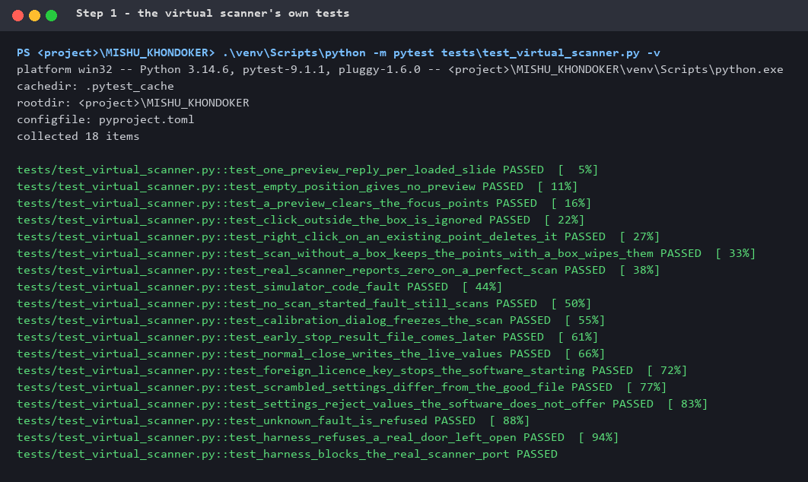
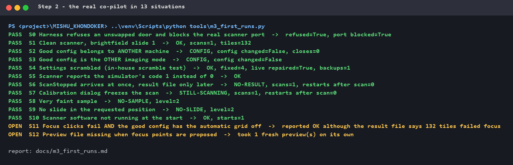
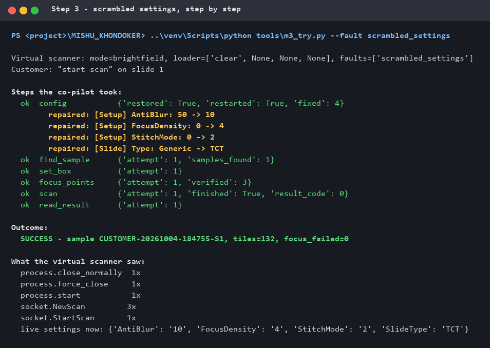
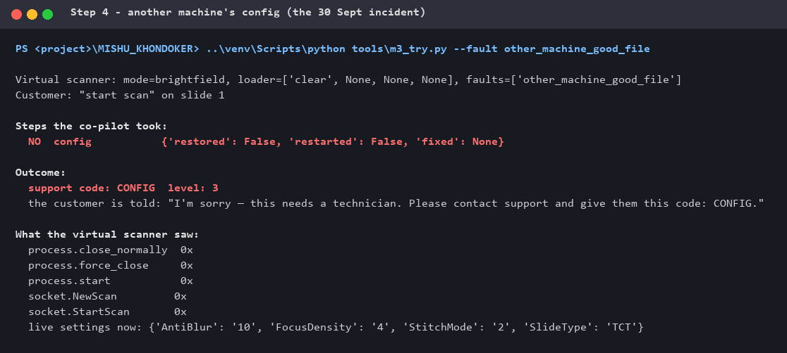
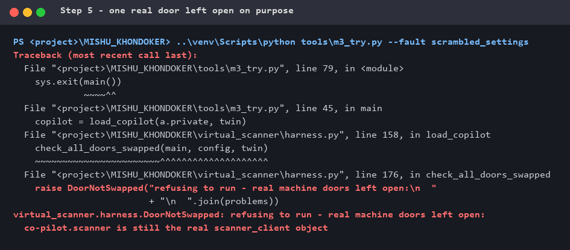
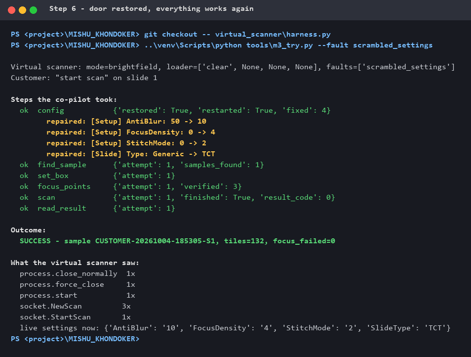

# M3 walkthrough: checking the virtual instrument by hand

**Testing · Proof · Learning** — part of [M3 — Virtual instrument](M3_virtual_instrument.md)

Seven hands-on checks of the virtual scanner and of the real co-pilot running on
it, done one step at a time, each understood before the next. Every screenshot
is the **real terminal output of that run**, with the exact command that was
typed. The only change is that the local folder path is shortened to `<project>`.

| Step | Check | Result |
|---|---|---|
| 1 | The virtual scanner's own tests | ✅ 18 passed |
| 2 | The real co-pilot in 13 situations | ✅ 11 pass · 🟡 2 open (reproduced) · 0 fail |
| 3 | Scrambled settings, step by step | ✅ 4 settings repaired, then scanned |
| 4 | Another machine's config (the 30 Sept incident) | ✅ refused before anything was touched |
| 5 | One real door left open on purpose | ✅ the harness refused to run |
| 6 | Door restored | ✅ everything works again |
| 7 | Fidelity review against the real scanner | ✅ all 14 behaviours confirmed |

**Where the commands run:** in the personal repository folder. Steps 2–6 use the
private co-pilot project's Python (`..\venv\Scripts\python`), because they load
the real co-pilot; Step 1 uses this repository's own environment.

---

## Step 1 — Can we trust the test machine?

**Goal.** Before testing the co-pilot *on* the virtual scanner, check that the
virtual scanner behaves like the real one. If it does not, every later result
is worthless.

**Command**
```powershell
.\venv\Scripts\python -m pytest tests\test_virtual_scanner.py -v
```



*The final summary line was not captured when the output was copied; all 18
`PASSED` lines are shown as they appeared.*

**What it shows.** Three groups of tests:

| Group | Tests | Meaning |
|---|---|---|
| Behaves like the real scanner | the first 13 | each is a behaviour seen on the real machine — e.g. a right-click on a point deletes it (29 Sept), a perfect scan reports `0` (30 Sept), a foreign licence key stops the software (30 Sept) |
| Is strict | `settings_reject_values…`, `unknown_fault_is_refused` | refuses what the real machine refuses; a misspelt fault name is an error, not silently ignored |
| Is safe | the last 2 | a real door left open is caught; the real scanner's control port is blocked |

**Learned.** These tests check the **twin**, not the co-pilot. They answer
"can we trust the test machine?" — the question that comes first.

---

## Step 2 — The real co-pilot in 13 situations

**Goal.** Run the real, unchanged co-pilot on a fresh virtual scanner per
situation and compare what it did with what M1 says is correct.

**Command**
```powershell
..\venv\Scripts\python tools\m3_first_runs.py
```



**How to read one line.**

```
PASS  S2 Good config belongs to ANOTHER machine  ->  CONFIG, config changed=False, closes=0
```

| Part | Meaning |
|---|---|
| `S2 Good config belongs to ANOTHER machine` | the situation — the 30 Sept incident, recreated |
| `CONFIG` | the co-pilot's answer: a technician is needed |
| `config changed=False` | not one byte of the scanner's config was written |
| `closes=0` | the scanner software was not even closed |
| `PASS` | exactly what M1 rule G5 requires |

**What OPEN means.** Not a crash or a test error: a **known weakness, reproduced
on demand**. S11 is the important one — the customer is told the scan succeeded
while the result file shows all 132 tiles failed focus. Before, that was a
suspicion in M1; now it is repeatable evidence, and a fix can be proven by the
same scenario.

> **Update 2026-10-05:** S11 is fixed — no blind scan any more (`FOCUS-POINTS,
> scans=0`), proven with a mutation check. How, and why the obvious fix would
> have been wrong: [M3 — S11 fixed](M3_virtual_instrument.md#s11-fixed-2026-10-05--and-what-the-real-result-files-taught-first).

**Learned.** In M2 the licence-key guard was proven as a single function. Here
it is proven **inside the whole customer pipeline**, with the real co-pilot
making the decisions — the step up from M2 to M3.

---

## Step 3 — Scrambled settings, step by step

**Goal.** See every step the co-pilot takes when someone has changed four
settings in the scanner window and saved them (the in-house scramble test).

**Command**
```powershell
..\venv\Scripts\python tools\m3_try.py --fault scrambled_settings
```



**What it shows.** All four scrambled settings found and repaired (`50 -> 10`,
`0 -> 4`, `0 -> 2`, `Generic -> TCT`), the sample found, the box set, three focus
points verified, the scan finished, the result read: **SUCCESS**, and the live
settings ended equal to the good file.

**Check your understanding — why does the co-pilot close and restart the
scanner software before scanning?** Read the order in "What the virtual scanner saw":

| # | Saw | Why |
|---|---|---|
| 1 | `close_normally 1x` | Settings changed in the window live only in the software's memory. A **normal** close makes the software write what it really uses into `config.ini` — otherwise the co-pilot would compare an outdated file and miss the scramble (proven on the real scanner, 26 Sept). |
| 2 | `force_close 1x` | Closes the leftover helper process, so nothing overwrites the file while it is repaired. |
| — | *(compare, backup, write)* | Every value compared with the good file; a backup made; the four good values written. |
| 3 | `start 1x` | Only a restart makes the software re-read `config.ini` and use the repaired values. |

And `NewScan 3x`: once to find the sample, once to read the current box before
changing it, once to **verify** the new box. Nothing is trusted without being
read back (M1 rule G2).

**Learned.** The restart is the price of checking **every** setting, including
changes made in the window, instead of trusting a possibly outdated file.

---

## Step 4 — Another machine's config: the 30 Sept incident

**Goal.** Recreate the incident that locked a real scanner: the good config file
belongs to another machine, with a different licence key.

**Command**
```powershell
..\venv\Scripts\python tools\m3_try.py --fault other_machine_good_file
```



**What it shows,** compared with Step 3:

| | Step 3 | Step 4 |
|---|---|---|
| Steps taken | 6, all `ok` | **1** — `config` → `NO` |
| Customer is told | success | "this needs a technician … code: CONFIG" |
| `close_normally` / `start` / `StartScan` | 1x / 1x / 1x | **0x / 0x / 0x** |
| Live settings | repaired | **untouched** |

**Check your understanding — why does `close_normally 0x` matter, and not only
"the config was not written"?** Closing the software first and refusing
afterwards would (1) interrupt the customer's machine for nothing, (2) possibly
leave it closed, worse off than before, and (3) add one more action that could
go wrong. The safest refusal happens **before the first action**. The co-pilot
checks the licence key first and only then decides whether to close — the order
of those lines *is* the safety.

**Learned.** "Refuse before anything is written" becomes, in practice,
"refuse before anything is touched". And the customer message stays calm and
gives the technician a code (M1 rule G12).

---

## Step 5 — Break the safety on purpose

**Goal.** The harness keeps every test away from the real scanner. Prove it the
way the guard was proven in M2: switch it off and watch it fail safely.

**What was changed.** In `virtual_scanner/harness.py` one line was commented out,
so the co-pilot kept its **real** socket client:
```python
    # main.scanner = twin.socket
```

**Command**
```powershell
..\venv\Scripts\python tools\m3_try.py --fault scrambled_settings
```



**What it shows,** read from the bottom up:

| Line | Meaning |
|---|---|
| `co-pilot.scanner is still the real scanner_client object` | **which** door is open: the one that talks to the real scanner |
| `DoorNotSwapped: refusing to run …` | **what** happened: everything stopped |
| `harness.py, line 176, in check_all_doors_swapped` | **where**: the safety check |
| `harness.py, line 158, in load_copilot` | **when**: right after loading the co-pilot, before any tool ran |

Notice what is missing: no "Steps the co-pilot took", no "What the virtual
scanner saw". **Nothing ran.** Without this check the co-pilot would have used
its real connection, and a "test" could have sent a command to a real scanner.

**Learned.** The M2 lesson in a new place: a safety check only counts once you
have seen it fire.

---

## Step 6 — Put the door back

**Goal.** Undo the experiment exactly, and confirm that everything works again.

**Commands**
```powershell
git checkout -- virtual_scanner\harness.py
..\venv\Scripts\python tools\m3_try.py --fault scrambled_settings
```



**What it shows.** `git checkout --` restored the file exactly as it was (no
trace of the experiment), and the full run is back: four settings repaired,
**SUCCESS**, `StartScan 1x`.

**Learned.** A deliberate break needs a clean, exact undo — and a run that
proves the undo worked.

---

## Step 7 — Is the twin true to the real machine?

**Goal.** Steps 1–6 rest on one assumption: the virtual scanner behaves like the
real one. The tests in Step 1 only show that the twin does what it was built to
do; whether that matches the machine can only be confirmed by someone who saw
the machine do it.

**What was done.** Each of the 14 behaviours in the
[fidelity table](M3_virtual_instrument.md#3-fidelity-every-behaviour-comes-from-a-real-observation)
was reviewed against first-hand experience with the real scanners.

**Result.** All 14 confirmed correct.

**Learned.** This is the check that matters most, and it is not automatable. A
wrong line in the fidelity table would make the twin teach something false —
with every test still green.

---

## What this walkthrough demonstrates

| | |
|---|---|
| **Testing** | The real, unchanged agent driven end to end on a virtual machine, with real failure modes switched on at will |
| **Proof** | Results that can be read line by line: what the agent did, what the machine saw, what the customer was told — including two weaknesses reproduced as evidence |
| **Safety** | A harness that refuses to run when a real machine could be reached, shown by breaking it on purpose |
| **Learning** | Each step understood before the next: why a restart is needed, why refusing before acting matters, why a twin must be checked against reality |
