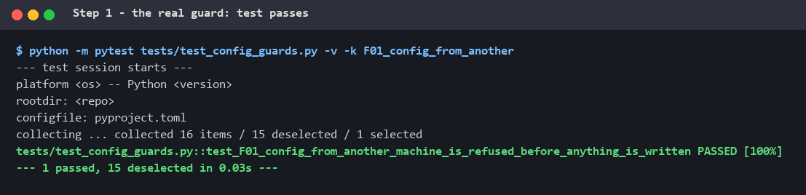
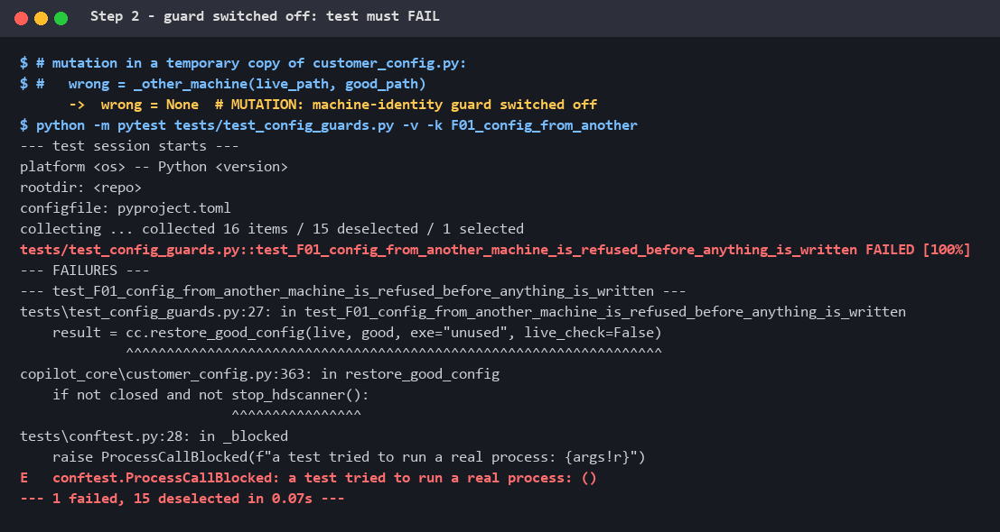
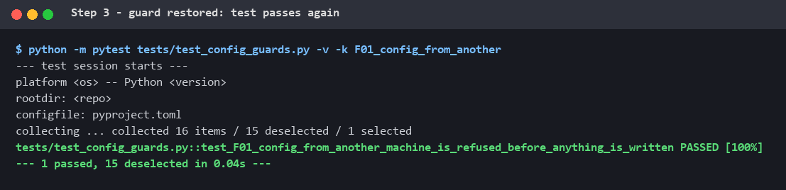

# Proof: a test that catches a real production incident

**Testing · Proof · Learning** — part of [M2 — Test foundation](M2_test_foundation.md)

A test only counts if it can fail. This page shows one of the co-pilot's most
important tests catching the exact incident it was written for — and shows it
by **breaking the safety guard on purpose** and watching the test fail.

---

## 1. The incident (real, 30 September 2026)

The co-pilot has a **Customer mode**: the customer says "start scan" and the
agent checks the scanner's configuration against a known-good file, repairs
anything that differs, and scans.

On one production scanner, the known-good file it was pointed at belonged to
**another scanner**. The agent "repaired" the configuration with that machine's
values — including its **machine-bound licence key**. The scanner software
refused to start: *"access security key invalid"*. It had to be recovered by
hand from a backup.

**Severity S4** in the [failure-mode catalogue](M1_definition_of_correct.md#6-failure-mode-catalogue-from-real-incidents)
(F01): the machine was locked.

## 2. The guard that was added

Before anything is closed, backed up or written, the restore compares the
licence key in the live config with the one in the good file. If both exist and
differ, it refuses (`copilot_core/customer_config.py`):

```python
def _other_machine(live_path, good_path):
    """Error text when the good file belongs to ANOTHER scanner (its licence key
    differs from this PC's) ... None = same machine (or a key missing, can't tell)."""
    ...
    if live_key and good_key and live_key.strip() != good_key.strip():
        return "The good config ... belongs to ANOTHER scanner ... nothing restored."
```

```python
def restore_good_config(...):
    ...
    wrong = _other_machine(live_path, good_path)      # <- the guard
    ...
    if wrong:
        return {"ok": False, "restored": False, "restarted": False, "error": wrong}
```

The licence key is also excluded from every comparison and is never copied.

## 3. The test, line by line

`tests/test_config_guards.py`:

```python
def test_F01_config_from_another_machine_is_refused_before_anything_is_written(tmp_path):
    live = write_ini(tmp_path / "live.ini", base_config(key="AAAA1111FAKE"))   # ①
    good = base_config(key="BBBB2222FAKE")                                      # ②
    good["Setup"]["FocusDensity"] = "10"                                        # ③
    good = write_ini(tmp_path / "good.ini", good)
    before = _sha(live)                                                         # ④

    result = cc.restore_good_config(live, good, exe="unused", live_check=False) # ⑤

    assert result["ok"] is False and result["restored"] is False                # ⑥
    assert "ANOTHER" in result["error"]                                         # ⑦
    assert _sha(live) == before                                                 # ⑧
    assert not list(tmp_path.glob("live.ini.customer-backup-*"))                # ⑨
```

| # | What it does | Why |
|---|---|---|
| ① | A **fake** config for "this" machine, key `AAAA1111FAKE`, in a throwaway folder | No real scanner file is ever used |
| ② | A fake good file with a **different** key | Recreates the incident |
| ③ | One real setting difference | Without it the test could pass for the wrong reason ("nothing to repair") |
| ④ | A SHA-256 fingerprint of the live file | To prove later that not one byte changed |
| ⑤ | Calls the real restore function | The code under test, unchanged |
| ⑥ ⑦ | It must refuse, and say why | A technician must understand the message |
| ⑧ | Fingerprint unchanged | The file was **not** touched |
| ⑨ | No backup was made | It refused **before** starting — not halfway |

**Safety net:** the restore function can force-close and restart the real
scanner software. The test suite replaces every such call with one that fails
the test (`tests/conftest.py`), so even a broken guard can never touch a machine.

## 4. The proof — mutation testing

A passing test alone proves little: it might pass whatever the code does. So
the guard is **switched off on purpose** (a *mutation*) to see whether the test
notices. [`tools/demo_mutation_test.py`](../tools/demo_mutation_test.py) does
this in a temporary copy of the code and checks each result itself. The
pictures below are its real output.

### Step 1 — the real guard: the test passes



### Step 2 — guard switched off: the test fails

The guard line is replaced by `wrong = None`. The code no longer notices the
other machine's key, decides to "repair", and goes on to close the scanner
software (`customer_config.py:363`, `stop_hdscanner()`). The test's safety net
stops it there and the test **fails in 0.07 s** — this is the 30 September
incident, caught without touching any machine.



### Step 3 — guard restored: the test passes again



**Result: the mutation was caught. The test is effective.**

## 5. What this demonstrates

| | |
|---|---|
| **Testing** | A real production incident turned into an automated regression test with synthetic data, running in CI on every push |
| **Proof** | Mutation testing shows the test fails when the guard is removed — and that even then, no machine is touched |
| **Learning** | See below |

## 6. What I learned

- **A test only counts if it can fail.** Breaking my own guard and watching the
  test catch it is stronger evidence than any number of green ticks.
- **Design the test so it cannot pass by accident.** Without step ③ the restore
  would have had nothing to do, and the test would pass even with no guard.
- **Check "nothing happened" precisely.** A fingerprint of the file and the
  absence of a backup prove the refusal came *before* any write — the property
  that actually matters on a real machine.
- **Tests that touch machines need their own safety net.** The code under test
  can stop and start real programs; the test suite must make that impossible.
- **Incidents are requirements.** Every real failure becomes a named rule (F01),
  a guard, and a test that keeps it from coming back.

## 7. Repeat it yourself

```bash
pip install -r requirements-dev.txt
python tools/demo_mutation_test.py            # prints OK for all 3 steps
python tools/demo_mutation_test.py --render   # also redraws the pictures
```

The script never changes the real code: it works on a temporary copy and
deletes it afterwards. It exits with code 0 only if the mutation is caught.
