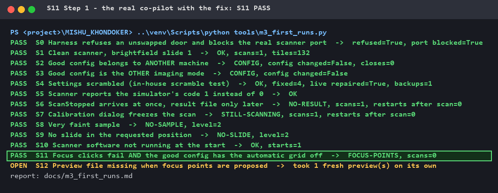
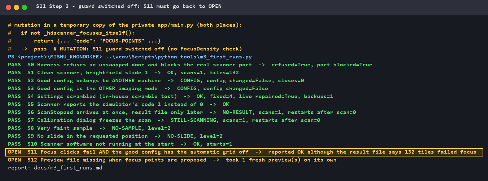

# Fixed: the co-pilot told a customer "success" for a scan with no focus

**Finding · Evidence · Fix · Proof** — part of [M3 — Virtual instrument](M3_virtual_instrument.md)

The virtual scanner found a **false success claim** in the real co-pilot. This
page shows how it was fixed — and why the first, obvious fix would have been
wrong. Every picture is real terminal output.

---

## 1. The finding (M3 scenario S11)

In **Customer mode** the customer says "scan slide 1" and the co-pilot does the
rest: finds the sample, frames it, places three focus points, scans, reads the
result.

When the focus points **cannot be placed**, the co-pilot falls back to "the
scanner's own focus". But on one production configuration that automatic focus
grid is **switched off** (`FocusDensity = 0`). Then there is nothing to fall
back on: the scan runs **with no focus at all** — and the customer is told it
**succeeded**.

S11 recreates exactly that on the virtual scanner: focus clicks fail, automatic
grid off. First run — **OPEN**, the false success reproduced:

```
OPEN  S11 Focus clicks fail AND the good config has the automatic grid off
          ->  reported OK although the result file says 132 tiles failed focus
```

Against the [M1 release gate](M1_definition_of_correct.md): *never claim success
that was not confirmed.* An honest "failed" is always better than a wrong
"success" — the customer leaves, and the blurry images are found later.

## 2. The obvious fix — and why the real result files stopped it

The obvious fix: the scanner writes a result file (`Scan.txt`) with a
`[Focus] Failed=` line — refuse when it is above 0.

**Before building it, three real result files from a production scanner were
checked.** Two of them (coordinates in µm):

```ini
[Focus]                                   ; scan 1 - images SHARP
F0=13011.4/14674.8/2257.5um -0.0
F1=6816.6/17841.0/2241.5um 0.0
F2=13794.6/7136.4/2260.8um -0.0
Z=0.002491X-0.000179Y+2227.709732
StdDev=0.00
Excluded=0
Failed=1
Offset=0.7um
```

```ini
[Focus]                                   ; scan 2 - images sharp
F0=11454.8/-10319.5/2301.7um -0.0
F1=9988.4/-10426.1/2305.9um -0.0
F2=12906.5/-9796.4/2303.2um -0.0
Z=-0.003849X+0.013548Y+2485.598009
StdDev=0.00
Excluded=0
Failed=0
```

| What the real files showed | What it means |
|---|---|
| `Failed=1` on a scan with **sharp** images | "`Failed > 0` → failed" would report **good** scans as failed — swapping one false message for the opposite one |
| Every file: three measured points `F0–F2` and a fitted focus plane `Z=…` | The co-pilot's focus points really are what the scanner focuses with |
| No real *unfocused* result file exists yet | The virtual scanner's `Failed = <all tiles>` is an **assumption**, not an observation |

**Lesson:** a fix built on the simulator's result file would have passed the
virtual test and failed on the real machine. Look at real data first.

## 3. The fix that does not depend on that guess

Stop the blind scan **before it starts**. When the focus points cannot be
placed, check whether the scanner can focus on its own — and if not, refuse:

```python
def _hdscanner_focuses_itself() -> bool:
    """True when HDScanner focuses on its own (Setup → FocusDensity > 0). With 0
    there is NO fallback: a scan without our focus points is a scan with no focus.
    Unreadable → False (refuse rather than risk a blind scan)."""
    try:
        return _read_ini(LIVE_CONFIG).getint("Setup", "FocusDensity", fallback=0) > 0
    except Exception:
        return False
```

```python
        if not placed.get("ok"):                       # focus points could not be placed
            ...
            if not _hdscanner_focuses_itself():        # <- the new guard
                return {"ok": False, "code": "FOCUS-POINTS", "unreachable": False}
            # otherwise: scan with the scanner's own focus, as before
```

The customer now gets an honest technician code (`FOCUS-POINTS`) instead of a
blurry "success". It uses only facts the co-pilot controls — its own placement
result and the configuration — so it is correct whatever the result file says.

S11 was tightened at the same time: it passes **only** with `FOCUS-POINTS`
**and no scan started** (`scans=0`) — so a later change cannot quietly start
the blind scan again and still pass.

## 4. The proof — fix on, fix off, fix on

[`tools/demo_s11_fix.py`](../tools/demo_s11_fix.py) runs all 13 M3 scenarios
three times and checks each result itself. Step 2 switches the guard off in a
**temporary copy** of the co-pilot — the real code is never changed.

### Step 1 — the real co-pilot with the fix: S11 PASS

No blind scan: `FOCUS-POINTS, scans=0`. Every other scenario still passes.



### Step 2 — guard switched off: S11 goes back to OPEN

Without the two guard lines, the old false success comes straight back.



### Step 3 — the real co-pilot again: S11 PASS again


**Result: the mutation was caught. S11 really tests the fix.**

## 5. What this demonstrates

| | |
|---|---|
| **Finding** | A digital twin running the real, unchanged agent exposed a false success claim that had only been suspected |
| **Evidence** | Real production result files checked **before** building — they showed the obvious fix would have been wrong |
| **Fix** | Built on facts the agent controls, not on an unverified reading of the machine's output |
| **Proof** | Scenario passes with the fix, fails without it (mutation), and nothing else changed |

## 6. What I learned

- **Look at real data before you build the fix.** `Failed=1` on a sharp scan
  would have turned one false message into the opposite one.
- **A digital twin is only as true as its observations.** The twin's unfocused
  result file was my assumption — it is now marked as such until a real one is
  seen.
- **Prevent rather than detect, when you can.** Refusing the blind scan before
  it starts needs no guessing about the result, and saves the customer a
  useless scan.
- **Make the test say exactly what matters.** "Not OK" was not enough; "refused
  with the right code **and no scan started**" is the property the customer needs.

## 7. Still open

One controlled scan **without focus** on a real scanner, to see what the
scanner really writes. Then the twin's result file is corrected, and it is
decided whether a check *after* the scan is needed as well.

## 8. Repeat it yourself

Needs the private co-pilot next to this repository (like all M3 runs):

```powershell
..\venv\Scripts\python tools\demo_s11_fix.py            # prints OK for all 3 steps
..\venv\Scripts\python tools\demo_s11_fix.py --render   # also redraws the pictures
```

Exit code 0 only if the mutation is caught.
