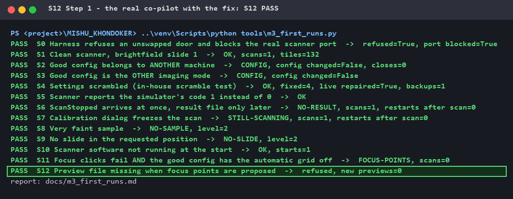
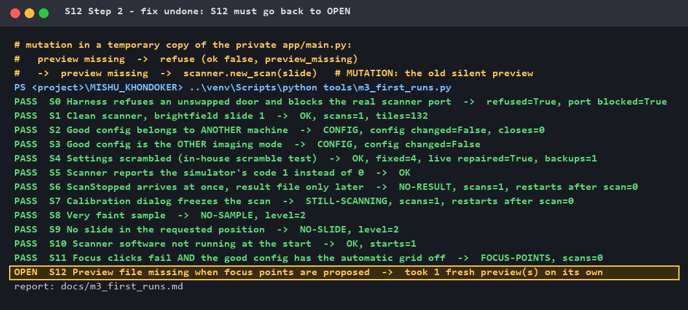
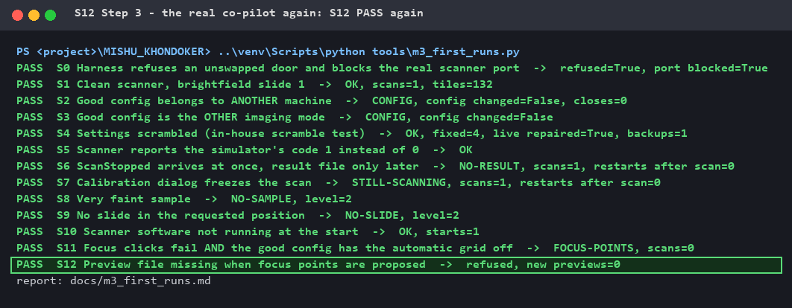

# Fixed: a "look only" tool that quietly changed the machine

**Finding · Incident · Fix · Proof** — part of [M3 — Virtual instrument](M3_virtual_instrument.md)

The second weakness the virtual scanner reproduced. A tool that promises to
**change nothing** took a new preview on its own — which wipes the scan box and
the focus points. This page shows the real incident, the fix, and the proof.
Every picture is real terminal output.

---

## 1. The tool and its promise

Before a scan, the co-pilot proposes where to put the **focus points**
(`find_focus_points`). It looks at the preview picture the scanner already saved
and suggests points on the sample, inside the scan box. It is a **look-and-propose**
tool — the user confirms before anything is placed.

Its promise, in the [M1 definition of correct](M1_definition_of_correct.md) and in
the description the language model reads:

> Changes nothing and does **not** take a new preview (that would wipe existing points).

On this scanner a new preview **resets the scan box and deletes the focus points**
already placed. So "look only" really matters.

## 2. What the code actually did

```python
# If preview doesn't exist, take a new one for this specific slide
if not os.path.exists(preview_path):
    ...
    preview = scanner.new_scan(slide_no=slide)     # <- a new preview, without asking
```

A convenience fallback: if the preview picture cannot be found, quietly take a
new one and carry on. It looks helpful — and it breaks the tool's promise.

## 3. The real incident (F11)

On a production scanner PC, the co-pilot's settings were missing the machine
paths, so it looked for the preview picture **in the wrong folder**. The picture
was "missing" — so the tool took a **new preview by itself**. The scan box the
user had set was gone, and the proposed points spread over the whole slide
instead of the box.

The root cause (the missing paths) was fixed on that PC the same day. But the
**tool still behaved the same way**: any future path problem would again wipe
the user's work silently — and the convenience fallback **hid** the
configuration error instead of reporting it. In the
[failure-mode catalogue](M1_definition_of_correct.md#6-failure-mode-catalogue-from-real-incidents)
it stayed 🟡: *"tool must refuse instead of previewing"*.

## 4. Reproduced on the virtual scanner (M3 scenario S12)

S12 sets a scan box, removes the preview files, and asks for focus points.
First run — **OPEN**:

```
OPEN  S12 Preview file missing when focus points are proposed  ->  took 1 fresh preview(s) on its own
```

## 5. The fix — refuse rather than guess

M1 rule **G3**: *when a precondition fails, the action refuses with a reason.*

```python
    if not os.path.exists(preview_path):
        return {"ok": False, "preview_missing": True,
                "error": (f"No preview picture for slide {slide + 1} ({preview_path}). "
                          "I did not take a new one myself: a new preview clears the scan box "
                          "and the focus points. Take a preview of this slide first, then ask "
                          "for focus points again.")}
```

The ten-line fallback became one honest refusal. The message says **what is
wrong** (and which file it looked for — exactly what reveals a wrong path),
**why nothing was done**, and **what to do next**.

**Nothing else had to change:** in Customer mode the preview is always taken
first by the sample finder, and a refusal here goes into the normal
focus-failure path — which, since the [S11 fix](demo_s11_fix.md), either uses the
scanner's own focus or stops honestly.

S12 was tightened at the same time: it passes **only** when no new preview was
taken **and** the answer is `ok: false` with `preview_missing: true` — so the
tool can neither wipe the box nor quietly "succeed" some other way.

## 6. The proof — fix on, fix undone, fix on

[`tools/demo_m3_fix.py`](../tools/demo_m3_fix.py) runs all 13 M3 scenarios
three times and checks each result itself. Step 2 puts the old silent preview
back in a **temporary copy** of the co-pilot — the real code is never changed.

### Step 1 — the real co-pilot with the fix: S12 PASS

Refused, no new preview. With S11 fixed too, **all 13 scenarios pass**.



### Step 2 — fix undone: S12 goes back to OPEN

With the old fallback back in place, the tool takes a preview on its own again.



### Step 3 — the real co-pilot again: S12 PASS again



**Result: the mutation was caught. S12 really tests the fix.**

## 7. What this demonstrates

| | |
|---|---|
| **Finding** | A real field incident turned into a repeatable scenario on the digital twin |
| **Fix** | A "helpful" fallback replaced by an honest refusal — the tool now keeps its own promise |
| **Proof** | Scenario passes with the fix, fails without it (mutation), and all 13 scenarios pass |

## 8. What I learned

- **A convenience fallback can hide a real fault.** The silent preview did not
  just wipe the box — it covered up the wrong configuration that caused it. The
  refusal now *shows* the wrong path.
- **A tool's promise must hold in the code, not only in its description.** The
  language model was told "does not take a new preview"; the code did. Agents
  plan on what tools promise.
- **Fixing the root cause on one machine is not the same as fixing the tool.**
  The paths were fixed the same day — the next machine with a wrong path would
  have hit it again.
- **Make the test check the right answer, not only the absence of the wrong
  one.** "No new preview" is not enough; the tool must also *say* it refused.

## 9. Repeat it yourself

Needs the private co-pilot next to this repository (like all M3 runs):

```powershell
..\venv\Scripts\python tools\demo_m3_fix.py s12            # prints OK for all 3 steps
..\venv\Scripts\python tools\demo_m3_fix.py s12 --render   # also redraws the pictures
```

Exit code 0 only if the mutation is caught.
