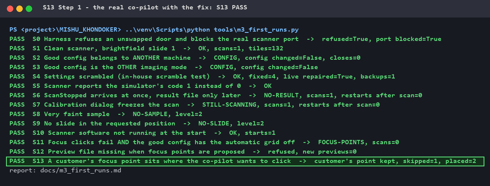
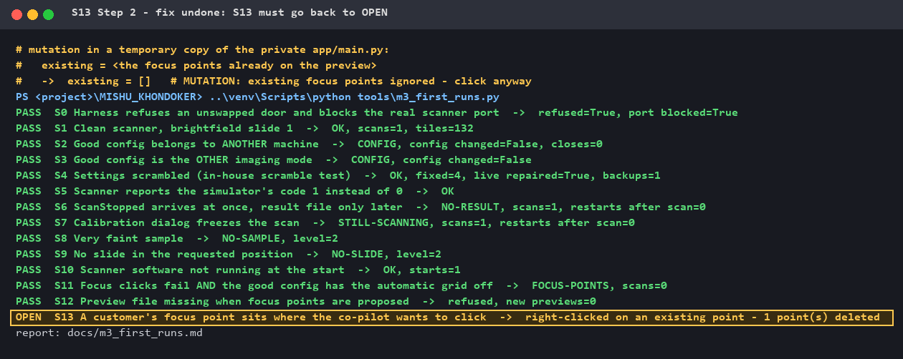

# Fixed: placing a focus point could delete one

**Finding · Fix · Proof** — part of [M3 — Virtual instrument](M3_virtual_instrument.md)

The co-pilot places focus points the way an operator does: a **right-click** on
the preview. But on this scanner a right-click **on an existing focus point
deletes it**. So "add a point" could quietly become "remove a point" — the
customer's, the scanner's own, or even one the co-pilot had just placed itself.
Every picture is real terminal output.

---

## 1. The machine behaviour (real, 29 September 2026)

Observed while placing focus points on a production scanner: right-clicking on a
green focus point that is already there **removes it**. Nothing warns; the point
is simply gone. In the [failure-mode catalogue](M1_definition_of_correct.md#6-failure-mode-catalogue-from-real-incidents)
this is **F12** — *"placement must avoid existing points"*.

## 2. Three ways the co-pilot could delete a point

| Whose point | How it happens |
|---|---|
| **The customer's** | The operator already placed a point; a proposed point lands on it |
| **The scanner's own grid** | With automatic focus on, every slide can carry a grid of points (20 on the real screenshots below) — a proposed point can land on one |
| **Its own, on the retry** | Customer mode tries the focus step twice with the **same** proposal. If try 1 places 2 of 3 points, try 2 clicks all 3 again — and deletes the 2 it just placed |

The placement code already **took a screenshot of the existing points** before
clicking — but only used it afterwards, to count the new ones. It never asked
"is there a point where I am about to click?"

## 3. Reproduced on the virtual scanner (M3 scenario S13)

The twin deletes a point on right-click, exactly like the real machine (that
behaviour has its own CI test). S13: the sample is framed, the co-pilot proposes
three focus points, and the customer already has a point **exactly where point 1
will go**. First run — **OPEN**:

```
OPEN  S13 A customer's focus point sits where the co-pilot wants to click  ->  right-clicked on an existing point - 1 point(s) deleted
```

## 4. The fix — look first, skip and report

The decision belongs in the co-pilot, not in the screen-reading code: there the
virtual scanner can test it. So the part that reads the screen now also says
**where** the existing green points are, and the co-pilot decides:

```python
# A right-click ON an existing focus point deletes it (real scanner, 2026-09-29; F12).
# How close counts is not measured, so stay well clear: ~2 point widths.
EXISTING_POINT_GAP_PX = 8
...
    seen = read_scan_boxes_on_screen(size)
    if not seen.get("ok"):
        return {"ok": False, "error": "Could not see the focus points already on the preview, so "
                                      "nothing was clicked ..."}
    existing = <the focus points already on this slide's preview>
    for each proposed point:
        if it is within EXISTING_POINT_GAP_PX of an existing point:
            skip it: "a focus point is already there - clicking would delete it"
        else:
            place it
```

| Situation | Before | Now |
|---|---|---|
| A proposed point sits on an existing one | clicked → **point deleted** | **skipped**, reported, the existing point stays |
| The other proposed points | placed | placed |
| The screen cannot be read | — | **nothing clicked** (it cannot know what it would delete) |
| Every point would hit an existing one | all deleted | nothing clicked, `ok: false` |
| Retry in Customer mode | deleted its own points from try 1 | skips them — they are already there |

## 5. The proof — fix on, fix undone, fix on

[`tools/demo_m3_fix.py`](../tools/demo_m3_fix.py) runs all 14 M3 scenarios
three times and checks each result itself. Step 2 makes the co-pilot ignore the
existing points again, in a **temporary copy** — the real code is never changed.

### Step 1 — the real co-pilot with the fix: S13 PASS

The customer's point is kept; one proposed point skipped, the other two placed.
**All 14 scenarios pass.**



### Step 2 — fix undone: S13 goes back to OPEN

With the existing points ignored, the co-pilot clicks on the customer's point
and deletes it.



### Step 3 — the real co-pilot again: S13 PASS again


**Result: the mutation was caught. S13 really tests the fix.**

## 6. The part the twin cannot test — checked on real screenshots

The virtual scanner replaces the screen-reading code, so M3 cannot prove that
the **real** screen reading finds the points. It was run offline on screenshots
saved from a production scanner:

| Real screenshot | Points found |
|---|---|
| Before placement, automatic focus on | **20 per slide, in a regular 4 × 5 grid** inside the scan box — the scanner's own grid |
| After the co-pilot placed 3 points | **3**, inside the small scan box |

**Open, to check live on the machine:** on slides that were not selected, the
reader finds one "point" at **exactly the centre of the scan box**. It is either
a real single focus point or a centre marker the software draws. If it is only a
marker, the co-pilot skips a proposed point near the box centre that it did not
need to skip — the safe side, but worth knowing.

## 7. What I learned

- **"Add" can be "delete" on a real machine.** The same click does both; only
  the state of the screen decides which. An agent must look before it acts.
- **A retry is not harmless.** Repeating a step that already half-worked can
  undo the half that worked. The guard now protects the retry too.
- **Put the decision where it can be tested.** The screen code only reports
  what it sees; the co-pilot decides. That split is what made the fix provable
  on the twin.
- **Name what the twin cannot cover — and check it another way.** The screen
  reading was checked on real screenshots, and the one open question is written
  down instead of assumed.

## 8. Repeat it yourself

Needs the private co-pilot next to this repository (like all M3 runs):

```powershell
..\venv\Scripts\python tools\demo_m3_fix.py s13            # prints OK for all 3 steps
..\venv\Scripts\python tools\demo_m3_fix.py s13 --render   # also redraws the pictures
```

Exit code 0 only if the mutation is caught.
